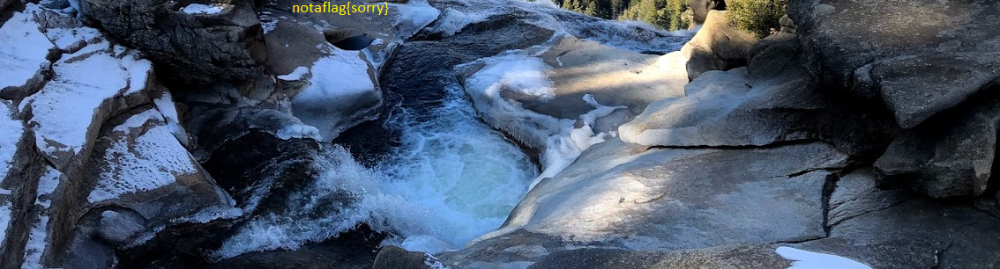

# tunn3l v1s10n

## Download
```bash
wget "https://mercury.picoctf.net/static/01be2b38ba97802285a451b94505ea75/tunn3l_v1s10n"
```
## let's have a look
```bash
 $ xxd tunn3l_v1s10n | head
```
```
00000000: 424d 8e26 2c00 0000 0000 bad0 0000 bad0  BM.&,...........
00000010: 0000 6e04 0000 3201 0000 0100 1800 0000  ..n...2.........
00000020: 0000 5826 2c00 2516 0000 2516 0000 0000  ..X&,.%...%.....
00000030: 0000 0000 0000 231a 1727 1e1b 2920 1d2a  ......#..'..) .*
00000040: 211e 261d 1a31 2825 352c 2933 2a27 382f  !.&..1(%5,)3*'8/
00000050: 2c2f 2623 332a 262d 2420 3b32 2e32 2925  ,/&#3*&-$ ;2.2)%
00000060: 3027 2333 2a26 382c 2836 2b27 392d 2b2f  0'#3*&8,(6+'9-+/
00000070: 2623 1d12 0e23 1711 2916 0e55 3d31 9776  &#...#..)..U=1.v
00000080: 668b 6652 996d 569e 7058 9e6f 549c 6f54  f.fR.mV.pX.oT.oT
00000090: ab7e 63ba 8c6d bd8a 69c8 9771 c193 71c1  .~c..m..i..q..q.
```
Starts with *BM*  
This looks like a BMP image, see [wiik](https://en.wikipedia.org/wiki/BMP_file_format#Bitmap_file_header) for the header fields

* offset 0x0A, 4B "bad0 0000" - this looks suspect
  * _The offset, i.e. starting address, of the byte where the bitmap image data (pixel array)._
* offset 0x0E, 4B: "bad0 0000" - also suspect
  * _the size of this header, in bytes (40)_
## fixing the header
```bash
$ xxd tunn3l_v1s10n > tunn3l_v1s10n.hex
```
### offset
a bunch of zeroes seems to indicate the end of the header, at address 0x36 -> **3600 0000** (little endian)
### header size
40 -> **2800 0000** (dec to hex, little endian)

### result
```
00000000: 424d 8e26 2c00 0000 0000 3600 0000 2800  BM.&,...........
00000010: 0000 6e04 0000 3201 0000 0100 1800 0000  ..n...2.........
00000020: 0000 5826 2c00 2516 0000 2516 0000 0000  ..X&,.%...%.....
00000030: 0000 0000 0000 231a 1727 1e1b 2920 1d2a  ......#..'..) .*
00000040: 211e 261d 1a31 2825 352c 2933 2a27 382f  !.&..1(%5,)3*'8/
00000050: 2c2f 2623 332a 262d 2420 3b32 2e32 2925  ,/&#3*&-$ ;2.2)%
00000060: 3027 2333 2a26 382c 2836 2b27 392d 2b2f  0'#3*&8,(6+'9-+/
00000070: 2623 1d12 0e23 1711 2916 0e55 3d31 9776  &#...#..)..U=1.v
00000080: 668b 6652 996d 569e 7058 9e6f 549c 6f54  f.fR.mV.pX.oT.oT
00000090: ab7e 63ba 8c6d bd8a 69c8 9771 c193 71c1  .~c..m..i..q..q.
```
### and wirite it to a new file
```bash
xxd -r tunn3l_v1s10n.hex > tunn3l_v1s10n.bmp
```
almost there...

## image size
Maybe the there is something above? at 0x16, 4B we have the image hight: **3201 0000**  
with a bit of trial and error, we find a better value: **4003 0000**
```
00000000: 424d 8e26 2c00 0000 0000 3600 0000 2800  BM.&,...........
00000010: 0000 6e04 0000 4003 0000 0100 1800 0000  ..n...2.........
00000020: 0000 5826 2c00 2516 0000 2516 0000 0000  ..X&,.%...%.....
00000030: 0000 0000 0000 231a 1727 1e1b 2920 1d2a  ......#..'..) .*
00000040: 211e 261d 1a31 2825 352c 2933 2a27 382f  !.&..1(%5,)3*'8/
00000050: 2c2f 2623 332a 262d 2420 3b32 2e32 2925  ,/&#3*&-$ ;2.2)%
00000060: 3027 2333 2a26 382c 2836 2b27 392d 2b2f  0'#3*&8,(6+'9-+/
00000070: 2623 1d12 0e23 1711 2916 0e55 3d31 9776  &#...#..)..U=1.v
00000080: 668b 6652 996d 569e 7058 9e6f 549c 6f54  f.fR.mV.pX.oT.oT
00000090: ab7e 63ba 8c6d bd8a 69c8 9771 c193 71c1  .~c..m..i..q..q.
```
```bash
xxd -r tunn3l_v1s10n.hex > tunn3l_v1s10n_2.bmp
```

we can read our flag: __picoCTF{qu1t3_a_v13w_2020}__